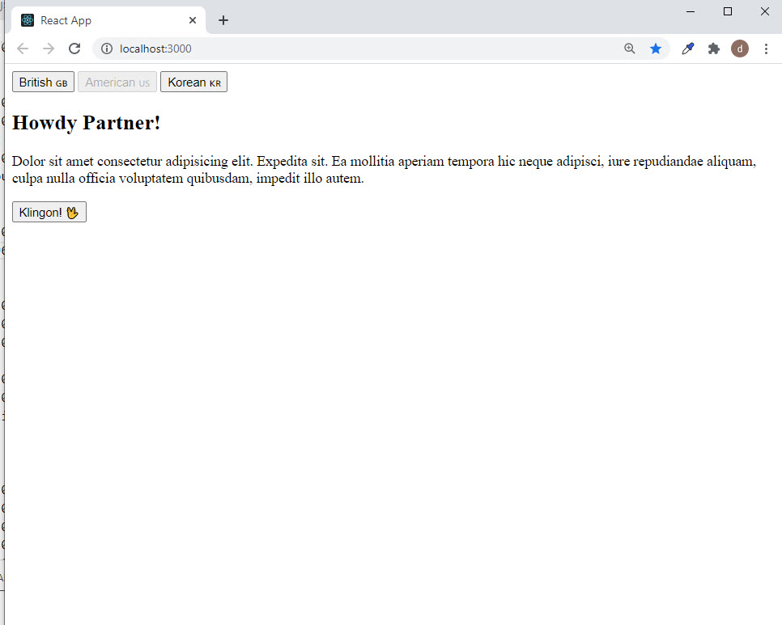

## >> App Name:
Language Selector APP

## >> APP Summary:
This simple app demonstrates the use of React context, listener, provider, and prop callback for deeply nested components.

## >> App Usage:
- Click on one of the three buttons on top and the corresponding text of the button selected will be displayed. Also, a button after the text display will invoke a callback from a deeply nested component.

## >> Screenshot 



## Github:
* GITHUB NAME: language-selector-app--react-context
* [Github Link:](https://github.com/davetam88/language-selector-app--react-context)

## TECHNOLOGIES USED in this app:
```
- HTML
- CSS
- Javascript: event.
- React Context, Provider, Consumer, and Prop Callback/event listener.
```
